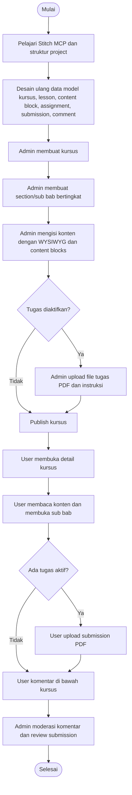
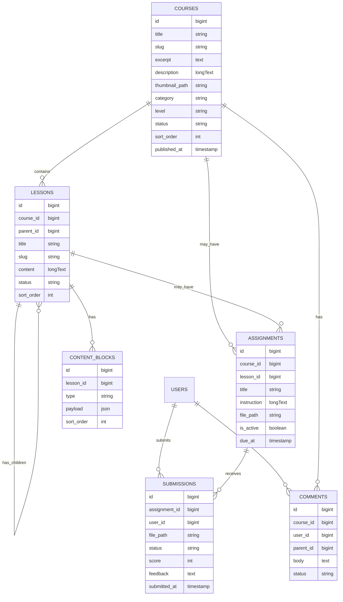

# Planning Implementasi Modul Kursus ThinkVerse

Dokumen ini adalah panduan implementasi untuk junior programmer atau AI model yang lebih murah. Fokusnya adalah membuat modul kursus yang bisa dikelola admin, memiliki sub bab bertingkat, konten WYSIWYG, komponen konten reusable, komentar, dan pengumpulan tugas PDF.

Target implementasi harus tetap mengikuti struktur Laravel yang sudah ada di project ini. Saat dokumen ini dibuat, project sudah memiliki model dan migration awal untuk `Course`, `Lesson`, `Comment`, dan `Submission`, tetapi relasi model, controller, validasi, UI admin, UI user, dan beberapa kebutuhan assignment masih perlu dirapikan.

---

## Tujuan Fitur

1. Admin bisa membuat dan mengelola kursus.
2. Setiap kursus memiliki section/sub bab yang bisa bertingkat.
3. Konten kursus dibuat memakai WYSIWYG editor.
4. Admin bisa menyusun konten dari komponen seperti card, accordion, card buku, link text, link button, gambar, embed YouTube, dan PDF.
5. Setiap kursus memiliki area komentar di bagian bawah halaman kursus.
6. Admin bisa mengaktifkan tugas untuk kursus, section, atau sub bab tertentu.
7. Tugas hanya memakai upload PDF, baik untuk file tugas dari admin maupun submission user.
8. User bisa melihat kursus, membaca sub bab, berkomentar, dan submit tugas PDF.

---

## Diagram Alur Utama

## Diagram Relasi Data

---

## Tahap 1: Pelajari Stitch MCP dan Struktur Project

Estimasi: 0.5 sampai 1 hari.

Tujuan tahap ini adalah memahami cara kerja MCP Stitch sebelum coding UI, lalu mencocokkannya dengan struktur Laravel yang sudah ada.

Yang harus dilakukan:

1. Pelajari kemampuan MCP Stitch yang tersedia, terutama:
   - `create_project` untuk membuat project desain/prototype jika diperlukan.
   - `generate_screen_from_text` untuk membuat screen awal dari prompt.
   - `edit_screens` untuk revisi screen.
   - `generate_variants` untuk membuat alternatif UI.
   - `list_design_systems`, `create_design_system`, dan `apply_design_system` untuk konsistensi desain.
2. Tentukan apakah Stitch dipakai hanya untuk referensi desain atau menjadi sumber utama mockup UI.
3. Buat daftar screen yang perlu ada:
   - Admin course index.
   - Admin create/edit course.
   - Admin lesson tree builder.
   - Admin content editor.
   - Admin assignment manager.
   - Admin submission review.
   - Public course list.
   - Public course detail.
   - Public lesson reader.
   - Public comment and submission area.
4. Baca file project yang relevan:
   - `routes/web.php`
   - `app/Models/Course.php`
   - `app/Models/Lesson.php`
   - `app/Models/Comment.php`
   - `app/Models/Submission.php`
   - migration pada folder `database/migrations`
   - layout Blade pada `resources/views/layouts`
5. Catat gap antara database saat ini dan kebutuhan fitur. Saat ini `comments` masih terhubung ke `lesson_id`, sedangkan requirement meminta komentar di bawah course. Saat ini `submissions` masih langsung ke `lesson_id`, sedangkan requirement membutuhkan tugas bisa di akhir course atau di setiap sub bab.

Output tahap ini:

- Catatan singkat cara memakai Stitch MCP untuk desain.
- Daftar screen final.
- Keputusan struktur data final sebelum migration dibuat.

---

## Tahap 2: Finalisasi Data Model dan Migration

Estimasi: 1 sampai 1.5 hari.

Tujuan tahap ini adalah memastikan database mampu menangani course, sub bab bertingkat, content blocks, komentar course, assignment fleksibel, dan submission PDF.

Yang harus dilakukan:

1. Lengkapi model `Course`:
   - Tambahkan `$fillable`.
   - Tambahkan relasi `lessons()`, `comments()`, dan `assignments()`.
   - Tambahkan scope `published()` jika diperlukan.
2. Lengkapi model `Lesson`:
   - Tambahkan `$fillable`.
   - Tambahkan relasi `course()`, `parent()`, `children()`, `contentBlocks()`, dan `assignments()`.
   - Gunakan `parent_id` untuk struktur bertingkat.
   - Urutan tampil memakai `sort_order`.
3. Ubah desain komentar:
   - Komentar harus berada di level course, bukan hanya lesson.
   - Buat migration untuk mengganti `lesson_id` menjadi `course_id` pada `comments`, atau buat ulang migration jika database masih development.
   - Tetap boleh ada `parent_id` untuk reply komentar.
4. Buat tabel `content_blocks`:
   - Kolom: `id`, `lesson_id`, `type`, `payload`, `sort_order`, timestamps.
   - `type` berisi: `wysiwyg`, `card`, `accordion`, `book_card`, `text_link`, `button_link`, `image`, `youtube_embed`, `pdf_file`.
   - `payload` berupa JSON agar setiap block fleksibel menyimpan data berbeda.
5. Buat tabel `assignments`:
   - Kolom minimal: `id`, `course_id`, `lesson_id nullable`, `title`, `instruction`, `file_path`, `is_active`, `due_at nullable`, timestamps.
   - Jika `lesson_id` kosong, artinya tugas berada di akhir course.
   - Jika `lesson_id` terisi, artinya tugas berada pada sub bab/section tersebut.
6. Refactor `submissions`:
   - Submission sebaiknya terhubung ke `assignment_id`, bukan langsung ke `lesson_id`.
   - Kolom minimal: `assignment_id`, `user_id`, `file_path`, `status`, `score`, `feedback`, `submitted_at`.
   - Pastikan satu user hanya memiliki satu submission aktif per assignment, atau tentukan apakah boleh resubmit.
7. Jalankan migration dan pastikan tidak error.

Output tahap ini:

- Migration final.
- Model dengan relasi lengkap.
- Database bisa menyimpan struktur kursus bertingkat dan assignment fleksibel.

---

## Tahap 3: Routing dan Controller Dasar

Estimasi: 1 hari.

Tujuan tahap ini adalah menyiapkan endpoint admin dan user secara jelas.

Yang harus dilakukan:

1. Buat route admin dengan middleware `auth` dan role admin:
   - `GET /admin/courses`
   - `GET /admin/courses/create`
   - `POST /admin/courses`
   - `GET /admin/courses/{course}/edit`
   - `PUT /admin/courses/{course}`
   - `DELETE /admin/courses/{course}`
   - `GET /admin/courses/{course}/lessons`
   - `POST /admin/courses/{course}/lessons`
   - `PUT /admin/lessons/{lesson}`
   - `DELETE /admin/lessons/{lesson}`
   - `POST /admin/lessons/{lesson}/blocks`
   - `PUT /admin/blocks/{block}`
   - `DELETE /admin/blocks/{block}`
   - `POST /admin/assignments`
   - `PUT /admin/assignments/{assignment}`
   - `GET /admin/assignments/{assignment}/submissions`
2. Buat route public/user:
   - `GET /courses`
   - `GET /courses/{course:slug}`
   - `GET /courses/{course:slug}/lessons/{lesson:slug}`
   - `POST /courses/{course}/comments`
   - `POST /assignments/{assignment}/submit`
3. Buat controller:
   - `Admin/CourseController`
   - `Admin/LessonController`
   - `Admin/ContentBlockController`
   - `Admin/AssignmentController`
   - `Admin/SubmissionReviewController`
   - `CourseController`
   - `LessonReaderController`
   - `CommentController`
   - `SubmissionController`
4. Gunakan Form Request untuk validasi:
   - `StoreCourseRequest`
   - `UpdateCourseRequest`
   - `StoreLessonRequest`
   - `UpdateLessonRequest`
   - `StoreContentBlockRequest`
   - `StoreAssignmentRequest`
   - `SubmitAssignmentRequest`
5. Pastikan semua route yang menerima upload file memakai validasi ukuran dan MIME type.

Output tahap ini:

- Route jelas dan tidak tercampur antara admin dan public.
- Controller minimal sudah bisa CRUD data utama.

---

## Tahap 4: Admin Course Management

Estimasi: 1 sampai 1.5 hari.

Tujuan tahap ini adalah admin bisa membuat, mengedit, menghapus, dan publish kursus.

Yang harus dilakukan:

1. Buat halaman daftar course admin:
   - Tampilkan judul, kategori, level, status, tanggal publish, dan action.
   - Tambahkan filter status `draft` dan `published`.
   - Tambahkan search berdasarkan judul.
2. Buat form create/edit course:
   - Field: title, slug, excerpt, description, thumbnail, category, level, status, sort_order, published_at.
   - Slug bisa otomatis dari title tetapi tetap bisa diedit.
   - Thumbnail memakai upload image.
3. Simpan file thumbnail ke disk Laravel, misalnya `storage/app/public/courses`.
4. Pastikan `php artisan storage:link` sudah dijalankan di environment development/production.
5. Tambahkan validasi:
   - title required.
   - slug unique.
   - thumbnail hanya image.
   - status hanya `draft` atau `published`.
6. Pastikan kursus `draft` tidak muncul di halaman public.

Output tahap ini:

- Admin bisa CRUD course.
- Public hanya melihat course published.

---

## Tahap 5: Lesson Tree Builder untuk Sub Bab Bertingkat

Estimasi: 1.5 sampai 2 hari.

Tujuan tahap ini adalah admin bisa membuat section/sub bab bertingkat di dalam course.

Yang harus dilakukan:

1. Buat halaman admin `Course Lessons`.
2. Tampilkan lessons dalam bentuk tree berdasarkan `parent_id`.
3. Setiap lesson punya:
   - title
   - slug
   - excerpt
   - parent_id
   - status
   - sort_order
4. Admin bisa:
   - tambah root section.
   - tambah child section.
   - edit section.
   - hapus section.
   - ubah urutan dengan input `sort_order` minimal dulu.
5. Untuk versi awal, drag and drop tidak wajib. Jika ingin drag and drop, implementasi bisa dilakukan setelah CRUD stabil.
6. Batasi tampilan tree agar mudah dibaca. Rekomendasi awal maksimal 4 level, walaupun database bisa menyimpan lebih.
7. Pastikan slug lesson unik. Jika slug global terlalu membatasi, ubah ke unique kombinasi `course_id + slug`.

Output tahap ini:

- Course memiliki daftar sub bab bertingkat.
- Admin bisa mengelola urutan dan parent-child lesson.

---

## Tahap 6: WYSIWYG Editor dan Content Blocks

Estimasi: 2 sampai 3 hari.

Tujuan tahap ini adalah admin bisa membuat isi lesson dengan editor rich text dan komponen konten.

Rekomendasi teknis:

- Untuk WYSIWYG gunakan library yang mudah: Tiptap, TinyMCE, CKEditor, atau Quill.
- Untuk implementasi cepat di Blade/Laravel, TinyMCE atau CKEditor lebih sederhana.
- Simpan HTML hasil WYSIWYG ke block `type = wysiwyg`.
- Sanitasi HTML sebelum render ke public untuk mengurangi risiko XSS.

Content blocks yang harus dibuat:

1. `wysiwyg`
   - Payload: `{ "html": "..." }`
   - Render sebagai HTML konten utama.
2. `card`
   - Payload: `{ "title": "...", "body": "...", "variant": "info|warning|success" }`
   - Render sebagai kartu informasi.
3. `accordion`
   - Payload: `{ "items": [{ "title": "...", "body": "..." }] }`
   - Render sebagai daftar accordion.
4. `book_card`
   - Payload: `{ "title": "...", "author": "...", "cover_path": "...", "description": "...", "url": "..." }`
   - Cover opsional tetapi disarankan.
5. `text_link`
   - Payload: `{ "label": "...", "url": "..." }`
   - Bisa disisipkan di area konten.
6. `button_link`
   - Payload: `{ "label": "...", "url": "...", "style": "primary|secondary" }`
   - Render sebagai tombol.
7. `image`
   - Payload: `{ "path": "...", "alt": "...", "caption": "..." }`
   - Upload hanya image.
8. `youtube_embed`
   - Payload: `{ "url": "...", "video_id": "...", "title": "..." }`
   - Simpan `video_id`, bukan iframe mentah.
9. `pdf_file`
   - Payload: `{ "path": "...", "title": "...", "description": "..." }`
   - Upload hanya PDF.

Yang harus dilakukan:

1. Buat UI admin untuk menambah block ke lesson.
2. Buat partial Blade untuk setiap block:
   - `resources/views/components/course-blocks/wysiwyg.blade.php`
   - `resources/views/components/course-blocks/card.blade.php`
   - dan seterusnya.
3. Saat render public, loop semua block berdasarkan `sort_order`.
4. Validasi payload per type. Jangan menerima payload bebas tanpa pengecekan.
5. Untuk YouTube, buat helper untuk mengambil video id dari URL:
   - `https://www.youtube.com/watch?v=...`
   - `https://youtu.be/...`
6. Untuk upload image dan PDF, simpan file dengan path terstruktur:
   - image: `course-content/images`
   - PDF: `course-content/pdfs`

Output tahap ini:

- Admin bisa menyusun konten lesson dari WYSIWYG dan block.
- Public bisa melihat konten dengan tampilan rapi.

---

## Tahap 7: Assignment dan Upload PDF

Estimasi: 1 sampai 1.5 hari.

Tujuan tahap ini adalah admin bisa membuat tugas, upload file PDF tugas, dan user bisa submit PDF.

Yang harus dilakukan:

1. Buat form assignment admin:
   - Pilih course.
   - Pilih lesson opsional.
   - Jika lesson kosong, tugas dianggap tugas akhir course.
   - Field: title, instruction, PDF tugas, due_at, is_active.
2. Validasi file admin:
   - wajib PDF jika tugas membutuhkan file.
   - MIME: `application/pdf`.
   - Ukuran maksimal ditentukan, misalnya 10 MB.
3. Tampilkan assignment:
   - Di akhir halaman course jika `lesson_id` kosong.
   - Di halaman lesson jika `lesson_id` terisi.
4. Buat form submit user:
   - User hanya upload PDF.
   - User harus login.
   - Simpan ke `storage/app/public/submissions`.
5. Tentukan kebijakan resubmit:
   - Rekomendasi awal: user boleh mengganti submission selama status masih `pending`.
   - Jika status sudah `reviewed`, user tidak bisa submit ulang kecuali admin membuka ulang.
6. Buat halaman admin review submission:
   - Lihat daftar user, file PDF, waktu submit, status.
   - Admin bisa memberi score dan feedback.
   - Admin bisa ubah status menjadi `reviewed`.

Output tahap ini:

- Admin bisa memberi tugas di akhir course atau di sub bab tertentu.
- User bisa mengumpulkan PDF.
- Admin bisa review submission.

---

## Tahap 8: Komentar Course

Estimasi: 0.5 sampai 1 hari.

Tujuan tahap ini adalah setiap course punya area komentar di bagian bawah sendiri.

Yang harus dilakukan:

1. Tampilkan komentar di bagian bawah halaman detail course.
2. Komentar hanya bisa dikirim oleh user login.
3. Guest hanya melihat komentar dan CTA login.
4. Simpan komentar dengan `course_id`, `user_id`, `body`, `status`.
5. Jika memakai reply, gunakan `parent_id`.
6. Tambahkan proteksi spam sederhana:
   - body required.
   - minimal 3 karakter.
   - maksimal 1000 atau 2000 karakter.
   - rate limit route komentar.
7. Buat admin moderation minimal:
   - tampilkan daftar komentar.
   - admin bisa hide/unhide.
   - status: `visible`, `hidden`, `pending`.

Output tahap ini:

- Course punya komentar di bagian bawah.
- Admin bisa menyembunyikan komentar bermasalah.

---

## Tahap 9: Public Course Reader

Estimasi: 1 sampai 1.5 hari.

Tujuan tahap ini adalah user bisa membaca kursus dengan UX yang jelas.

Yang harus dilakukan:

1. Halaman `/courses`:
   - Card daftar course.
   - Filter kategori/level jika data sudah tersedia.
   - Empty state jika belum ada course.
2. Halaman detail course:
   - Thumbnail, title, excerpt, description.
   - Sidebar atau daftar isi lesson tree.
   - Tampilkan tugas akhir course jika ada.
   - Komentar di bagian bawah.
3. Halaman lesson reader:
   - Breadcrumb course.
   - Sidebar tree sub bab.
   - Render content blocks.
   - Tampilkan assignment lesson jika ada.
   - Tombol previous/next lesson berdasarkan urutan tree.
4. Pastikan hanya course dan lesson `published` yang bisa diakses public.
5. Jika course draft dibuka public, return 404.

Output tahap ini:

- User bisa membaca course dan semua sub bab.
- Tugas dan komentar muncul di posisi yang benar.

---

## Tahap 10: Security, Validasi, dan Sanitasi

Estimasi: 1 hari.

Tujuan tahap ini adalah mengurangi risiko bug dan celah keamanan.

Yang harus dilakukan:

1. Semua route admin wajib middleware admin.
2. Semua route submission dan komentar wajib login.
3. Validasi upload:
   - image hanya `jpg`, `jpeg`, `png`, `webp`.
   - PDF hanya `pdf`.
   - batasi ukuran file.
4. Sanitasi HTML WYSIWYG:
   - Jangan render iframe bebas dari input admin.
   - YouTube harus memakai video id yang divalidasi.
   - Link harus valid URL.
5. Pastikan file private atau public sesuai kebutuhan:
   - Materi course bisa public jika kursus public.
   - Submission user sebaiknya hanya bisa diakses admin dan pemilik.
6. Tambahkan policy bila diperlukan:
   - `CoursePolicy`
   - `AssignmentPolicy`
   - `SubmissionPolicy`
7. Pastikan tidak ada mass assignment error dengan `$fillable`.

Output tahap ini:

- Upload aman.
- Route terlindungi.
- HTML WYSIWYG tidak membuka XSS besar.

---

## Tahap 11: Testing Manual dan Automated Test

Estimasi: 1 sampai 1.5 hari.

Tujuan tahap ini adalah memastikan fitur utama tidak mudah rusak.

Minimal automated test:

1. Admin bisa membuat course.
2. User biasa tidak bisa akses admin course.
3. Course draft tidak tampil di public.
4. Course published tampil di public.
5. Admin bisa membuat lesson child.
6. Public bisa membaca lesson published.
7. User login bisa komentar di course.
8. Guest tidak bisa komentar.
9. Admin bisa membuat assignment course-level.
10. Admin bisa membuat assignment lesson-level.
11. User bisa submit PDF.
12. Upload non-PDF untuk submission ditolak.

Manual test:

1. Buat course baru dari admin.
2. Buat 2 root section dan 2 child section.
3. Isi lesson dengan semua jenis block.
4. Upload gambar, PDF materi, dan embed YouTube.
5. Aktifkan tugas di lesson.
6. Aktifkan tugas akhir course.
7. Login sebagai user.
8. Baca course dan submit PDF.
9. Kirim komentar.
10. Login sebagai admin dan review submission.

Output tahap ini:

- Test utama tersedia.
- Checklist manual sudah dijalankan.

---

## Tahap 12: Polishing UI dan Dokumentasi

Estimasi: 0.5 sampai 1 hari.

Tujuan tahap ini adalah membuat fitur cukup nyaman dipakai dan mudah dilanjutkan.

Yang harus dilakukan:

1. Rapikan empty state:
   - course belum ada.
   - lesson belum ada.
   - submission belum ada.
   - komentar belum ada.
2. Tambahkan pesan sukses/error setelah action admin dan user.
3. Pastikan tampilan mobile tidak rusak.
4. Dokumentasikan cara memakai fitur:
   - cara membuat course.
   - cara membuat sub bab.
   - cara menambah block.
   - cara membuat tugas.
   - cara review submission.
5. Tambahkan catatan teknis di README jika ada setup baru:
   - library WYSIWYG.
   - `php artisan storage:link`.
   - batas upload.

Output tahap ini:

- UI lebih stabil.
- Developer berikutnya bisa memahami alur tanpa membaca semua kode.

---

## Estimasi Total

Estimasi realistis untuk junior programmer:

| Tahap | Estimasi |
| --- | --- |
| Pelajari Stitch MCP dan struktur project | 0.5 - 1 hari |
| Data model dan migration | 1 - 1.5 hari |
| Routing dan controller dasar | 1 hari |
| Admin course management | 1 - 1.5 hari |
| Lesson tree builder | 1.5 - 2 hari |
| WYSIWYG dan content blocks | 2 - 3 hari |
| Assignment dan upload PDF | 1 - 1.5 hari |
| Komentar course | 0.5 - 1 hari |
| Public course reader | 1 - 1.5 hari |
| Security dan validasi | 1 hari |
| Testing | 1 - 1.5 hari |
| Polishing dan dokumentasi | 0.5 - 1 hari |

Total estimasi: 12 sampai 18 hari kerja untuk junior programmer.

Jika dikerjakan oleh AI model lebih murah dengan review manusia berkala, rekomendasinya pecah menjadi task kecil per tahap dan lakukan review setelah setiap tahap selesai. Jangan minta AI mengerjakan semua fitur sekaligus karena risiko salah desain data dan bug upload file cukup tinggi.

---

## Urutan Implementasi yang Disarankan

1. Selesaikan data model dulu.
2. Selesaikan admin CRUD course.
3. Selesaikan lesson tree.
4. Selesaikan render public course/lesson sederhana.
5. Tambahkan WYSIWYG.
6. Tambahkan content blocks satu per satu.
7. Tambahkan assignment PDF.
8. Tambahkan submission PDF.
9. Tambahkan komentar course.
10. Tambahkan admin review dan moderation.
11. Tambahkan test.
12. Polish UI.

---

## Acceptance Criteria

Fitur dianggap selesai jika:

1. Admin bisa membuat course published dan draft.
2. Admin bisa membuat sub bab bertingkat minimal sampai 3 level.
3. Admin bisa mengisi lesson dengan WYSIWYG.
4. Admin bisa menambah block card, accordion, book card, text link, button link, image, YouTube embed, dan PDF.
5. User bisa membuka course published dan membaca semua lesson published.
6. Komentar tampil di bawah halaman course.
7. User login bisa menulis komentar.
8. Admin bisa mengaktifkan tugas pada course atau lesson.
9. Admin bisa upload PDF tugas.
10. User bisa upload PDF submission.
11. File selain PDF ditolak untuk tugas dan submission.
12. Admin bisa melihat dan review submission.
13. Draft course/lesson tidak tampil di public.
14. Route admin tidak bisa diakses user biasa.

---

## Catatan untuk Implementer

- Jangan mulai dari UI kompleks sebelum data model assignment dan comment final.
- Jangan menyimpan iframe YouTube mentah dari input user/admin. Simpan URL atau video id, lalu render iframe dari template yang aman.
- Jangan render HTML WYSIWYG tanpa sanitasi.
- Jangan membuat komentar di bawah lesson jika requirement tetap menyebut komentar per course.
- Jangan membuat submission langsung ke lesson jika requirement membutuhkan tugas bisa berada di akhir course.
- Untuk versi pertama, prioritaskan fitur berjalan stabil dibanding drag and drop dan editor block yang terlalu kompleks.
