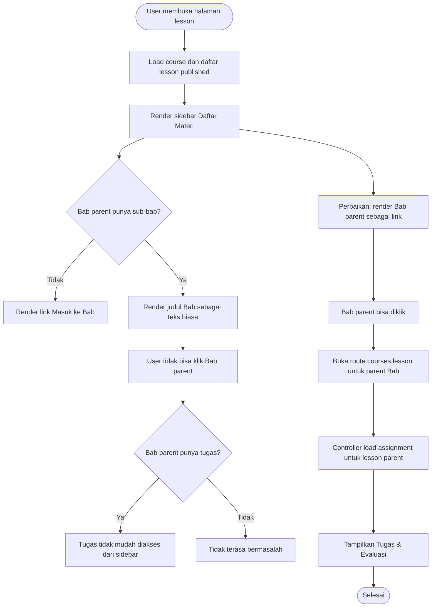

# Planning Perbaikan Bab Parent Tidak Bisa Diklik Saat Memiliki Penugasan

Dokumen ini adalah panduan implementasi untuk junior programmer atau AI model yang lebih murah. Scope fitur dibuat spesifik: memperbaiki navigasi lesson pada endpoint berikut agar Bab parent yang memiliki penugasan tetap bisa diklik dan user bisa membuka halaman tugasnya.

Endpoint yang perlu dicek:

```text
http://127.0.0.1:8000/courses/independent-financial-freedom/lessons/independent-6a2c246f7a910
```

Masalah yang dilaporkan:

```text
Bab 1: Apa itu Independent tidak bisa diklik, padahal di Bab tersebut ada penugasan.
```

---

## Tujuan Perbaikan

1. Bab parent di sidebar course navigation bisa diklik.
2. Jika Bab parent memiliki penugasan, user bisa membuka halaman Bab tersebut untuk melihat dan submit tugas.
3. Bab parent tetap bisa memiliki sub-bab.
4. Sub-bab tetap bisa diklik seperti sekarang.
5. UI sidebar tetap jelas membedakan:
   - Bab parent.
   - Sub-bab.
   - item yang sedang aktif.
   - Bab/sub-bab yang memiliki tugas.
6. Tidak ada perubahan besar pada struktur database jika tidak diperlukan.

---

## Dugaan Penyebab

Berdasarkan struktur view lesson saat ini, file yang perlu diperiksa adalah:

```text
resources/views/pages/courses/lesson.blade.php
```

Di sidebar `Daftar Materi`, Bab parent dirender seperti ini:

```blade
<div class="px-6 py-3 bg-surface/30">
    <h4>Bab {{ $index + 1 }}: {{ $chapter->title }}</h4>
</div>
```

Jika Bab memiliki children/sub-bab, yang menjadi link hanya sub-bab:

```blade
@foreach($chapter->children as $subLesson)
    <a href="{{ route('courses.lesson', [$course, $subLesson]) }}">
        {{ $subLesson->title }}
    </a>
@endforeach
```

Artinya, parent Bab tidak bisa diklik ketika memiliki sub-bab. Ini bermasalah jika assignment/penugasan dipasang pada parent Bab, karena user tidak bisa membuka halaman parent Bab dari navigasi sidebar.

---

## Diagram Alur / Flowchart



---

## Tahap 1: Reproduksi Masalah di Browser

Estimasi: 30 sampai 45 menit.

Tujuan tahap ini adalah memastikan masalah benar terjadi dan tidak salah membaca data.

Yang harus dilakukan:

1. Jalankan server lokal:

```bash
php artisan serve
```

2. Buka endpoint:

```text
http://127.0.0.1:8000/courses/independent-financial-freedom/lessons/independent-6a2c246f7a910
```

3. Lihat sidebar `Daftar Materi`.
4. Cari item:

```text
Bab 1: Apa itu Independent
```

5. Coba klik teks Bab tersebut.
6. Catat hasil:
   - apakah pointer berubah menjadi link.
   - apakah URL berubah.
   - apakah halaman parent Bab terbuka.
   - apakah section `Tugas & Evaluasi` muncul.
7. Klik sub-bab di bawahnya untuk memastikan sub-bab masih normal.
8. Ambil screenshot sebelum perbaikan jika diperlukan untuk dokumentasi.

Output tahap ini:

- Bug berhasil direproduksi.
- Implementer tahu bahwa masalah ada di navigasi Bab parent.

---

## Tahap 2: Audit Data Lesson dan Assignment

Estimasi: 45 menit sampai 1 jam.

Tujuan tahap ini adalah memastikan penugasan memang terpasang di Bab parent, bukan di sub-bab.

Yang harus dilakukan:

1. Cek data course berdasarkan slug:

```php
Course::where('slug', 'independent-financial-freedom')->first()
```

2. Cek lesson berdasarkan slug:

```php
Lesson::where('slug', 'independent-6a2c246f7a910')->first()
```

3. Cari Bab parent dengan title:

```text
Apa itu Independent
```

4. Pastikan field penting:
   - `id`
   - `course_id`
   - `parent_id`
   - `slug`
   - `status`
   - `sort_order`
5. Cek assignment yang terhubung ke lesson tersebut:

```php
Assignment::where('lesson_id', $chapter->id)->where('is_active', true)->get()
```

6. Pastikan route parent lesson bisa diakses manual:

```text
/courses/{courseSlug}/lessons/{chapterSlug}
```

7. Jika route manual parent lesson bisa dibuka dan tugas tampil, maka bug hanya di sidebar link.
8. Jika route manual parent lesson tidak menampilkan tugas, lanjut cek controller.

Output tahap ini:

- Diketahui apakah assignment berada di parent Bab.
- Diketahui apakah halaman parent Bab sebenarnya bisa dibuka melalui URL langsung.

---

## Tahap 3: Audit Controller Public Course Lesson

Estimasi: 30 sampai 45 menit.

Tujuan tahap ini adalah memastikan controller sudah mendukung membuka parent Bab dan mengambil tugasnya.

File yang dicek:

```text
app/Http/Controllers/PublicCourseController.php
```

Yang harus dilakukan:

1. Cek method:

```php
public function lesson(Course $course, Lesson $lesson)
```

2. Pastikan validasi ini benar:

```php
if ($course->status !== 'published' || $lesson->status !== 'published' || $lesson->course_id !== $course->id) {
    abort(404);
}
```

3. Pastikan assignment lesson diambil dari lesson aktif:

```php
$assignments = $lesson->assignments()->where('is_active', true)->get();
```

4. Pastikan fallback course-level assignment tidak menimpa assignment lesson.
5. Pastikan parent Bab dengan `status = published` bisa masuk ke method ini.
6. Jika controller sudah benar, tidak perlu refactor besar.
7. Jika parent Bab tidak punya content block tetapi punya assignment, halaman tetap harus menampilkan section `Tugas & Evaluasi`.

Output tahap ini:

- Controller dipastikan mendukung assignment pada parent Bab.
- Fokus perbaikan bisa diarahkan ke Blade sidebar.

---

## Tahap 4: Ubah Sidebar agar Bab Parent Bisa Diklik

Estimasi: 1 sampai 1.5 jam.

Tujuan tahap ini adalah membuat judul Bab parent menjadi link ke halaman lesson parent, meskipun Bab tersebut memiliki sub-bab.

File yang diedit:

```text
resources/views/pages/courses/lesson.blade.php
```

Yang harus dilakukan:

1. Cari blok sidebar:

```blade
@foreach($course->lessons->whereNull('parent_id') as $index => $chapter)
```

2. Ubah header Bab parent dari `<div>` biasa menjadi `<a>`.
3. Link harus mengarah ke:

```blade
route('courses.lesson', [$course, $chapter])
```

4. Pastikan active state bekerja saat lesson aktif adalah parent Bab:

```blade
$lesson->id === $chapter->id
```

5. Desain link parent harus tetap terlihat sebagai Bab, bukan seperti sub-bab biasa.
6. Tambahkan icon yang menandakan parent Bab bisa dibuka, misalnya:
   - `menu_book`
   - `play_circle`
   - `article`
7. Jangan menghapus list children/sub-bab.
8. Jika Bab parent memiliki children, tampilkan children di bawah link parent seperti sekarang.

Contoh arah perubahan:

```blade
<a href="{{ route('courses.lesson', [$course, $chapter]) }}"
   class="px-6 py-3 bg-surface/30 flex items-center justify-between transition-colors {{ $lesson->id === $chapter->id ? 'bg-primary/10 text-primary' : 'hover:bg-surface text-on-surface-variant' }}">
    <h4 class="font-bold text-sm">Bab {{ $index + 1 }}: {{ $chapter->title }}</h4>
    <span class="material-symbols-outlined text-[18px]">chevron_right</span>
</a>
```

Output tahap ini:

- Bab parent bisa diklik.
- Sub-bab tetap bisa diklik.
- Active state parent Bab tampil saat halaman parent Bab dibuka.

---

## Tahap 5: Tambahkan Indikator Tugas di Sidebar

Estimasi: 1 sampai 1.5 jam.

Tujuan tahap ini adalah membuat user tahu bahwa Bab parent atau sub-bab memiliki tugas.

Yang harus dilakukan:

1. Load jumlah assignment aktif untuk lessons agar tidak N+1 query.
2. Di controller, pertimbangkan update load course lessons:

```php
$course->load(['lessons' => function($q) {
    $q->where('status', 'published')
        ->withCount(['assignments as active_assignments_count' => function ($q) {
            $q->where('is_active', true);
        }])
        ->orderBy('sort_order');
}]);
```

3. Pastikan relasi `children` juga bisa mengetahui assignment count.
4. Jika `children` dipanggil lewat relasi lazy, update dengan eager loading:

```php
$course->load(['lessons' => function($q) {
    $q->where('status', 'published')
        ->with(['children' => function ($q) {
            $q->where('status', 'published')
                ->withCount(['assignments as active_assignments_count' => function ($q) {
                    $q->where('is_active', true);
                }])
                ->orderBy('sort_order');
        }])
        ->withCount(['assignments as active_assignments_count' => function ($q) {
            $q->where('is_active', true);
        }])
        ->orderBy('sort_order');
}]);
```

5. Di Blade, jika Bab punya assignment aktif, tampilkan badge kecil:

```blade
@if(($chapter->active_assignments_count ?? 0) > 0)
    <span class="text-[10px] font-bold bg-purple-100 text-purple-700 px-2 py-1 rounded-full">Tugas</span>
@endif
```

6. Lakukan hal yang sama untuk sub-bab.
7. Jangan membuat badge mengganggu layout mobile.

Output tahap ini:

- User bisa melihat Bab mana yang memiliki tugas.
- Bab parent dengan tugas lebih mudah ditemukan.

---

## Tahap 6: Pastikan Navigasi Course Detail Konsisten

Estimasi: 45 menit sampai 1 jam.

Tujuan tahap ini adalah memastikan halaman detail course juga tidak menyembunyikan link parent Bab.

File yang dicek:

```text
resources/views/pages/courses/show.blade.php
```

Yang harus dilakukan:

1. Cari daftar Bab di halaman course detail.
2. Pastikan parent Bab yang memiliki children tetap bisa diklik atau minimal punya link yang jelas.
3. Jika saat ini parent Bab hanya menjadi header saat punya children, ubah menjadi link seperti sidebar lesson.
4. Pastikan sub-bab tetap tampil di bawahnya.
5. Tambahkan badge `Tugas` jika parent Bab/sub-bab memiliki assignment aktif.
6. Pastikan tombol `Mulai Belajar` tidak hanya mengarah ke parent pertama jika parent tidak dimaksudkan sebagai content page.

Output tahap ini:

- Navigasi di course detail dan lesson page konsisten.
- User tidak bingung mencari tugas pada parent Bab.

---

## Tahap 7: Review UX untuk Bab Parent yang Punya Children

Estimasi: 30 sampai 45 menit.

Tujuan tahap ini adalah memastikan parent Bab bisa berfungsi sebagai halaman pembuka Bab, bukan hanya label kategori.

Yang harus diputuskan:

1. Apakah parent Bab memang boleh punya content dan assignment?
2. Jika ya, parent Bab wajib selalu clickable.
3. Jika tidak, admin seharusnya tidak bisa memasang assignment pada parent Bab. Namun requirement saat ini menyebut parent Bab punya penugasan, jadi pendekatan yang benar adalah membuat parent clickable.
4. Label yang disarankan:
   - Parent Bab tetap: `Bab 1: Apa itu Independent`
   - Jika punya tugas: tampilkan badge `Tugas`
   - Children tetap sebagai sub-item.
5. Jika parent Bab aktif, tampilkan highlight pada header Bab parent.

Output tahap ini:

- Keputusan UX jelas.
- Implementer tidak mengubah data assignment untuk menghindari masalah UI.

---

## Tahap 8: Testing Manual

Estimasi: 1 sampai 1.5 jam.

Tujuan tahap ini adalah memastikan bug benar-benar selesai.

Manual test:

1. Buka endpoint:

```text
http://127.0.0.1:8000/courses/independent-financial-freedom/lessons/independent-6a2c246f7a910
```

2. Klik `Bab 1: Apa itu Independent` di sidebar.
3. Pastikan URL berubah ke slug parent Bab.
4. Pastikan halaman parent Bab terbuka.
5. Pastikan section `Tugas & Evaluasi` tampil jika Bab tersebut punya assignment aktif.
6. Pastikan form submit tugas muncul untuk user login.
7. Pastikan guest melihat pesan login untuk submit tugas.
8. Klik sub-bab lain dan pastikan masih bisa dibuka.
9. Pastikan active state berpindah sesuai item yang diklik.
10. Cek tampilan mobile:
    - buka menu sidebar.
    - klik parent Bab.
    - pastikan navigasi bekerja.
11. Jika badge `Tugas` ditambahkan, pastikan badge tampil pada parent Bab yang punya tugas.

Output tahap ini:

- Bug parent Bab tidak bisa diklik terselesaikan.
- Assignment pada parent Bab bisa diakses user.
- Navigasi sub-bab tetap tidak rusak.

---

## Tahap 9: Automated Test

Estimasi: 1 sampai 2 jam.

Tujuan tahap ini adalah mencegah bug serupa muncul lagi.

Feature test yang disarankan:

1. Parent lesson dengan children bisa dibuka melalui route `courses.lesson`.
2. Parent lesson dengan assignment aktif menampilkan section `Tugas & Evaluasi`.
3. Halaman lesson menampilkan link ke parent chapter meskipun parent punya children.
4. Sub-bab tetap memiliki link.
5. Active state parent tampil saat parent lesson sedang dibuka.
6. Lesson draft tidak bisa dibuka public.
7. Lesson dari course lain tidak bisa dibuka pada course yang salah.

Catatan:

- Test HTML bisa memakai `assertSee` untuk teks Bab dan assignment.
- Untuk memastikan link ada, gunakan `assertSee(route('courses.lesson', [$course, $chapter]), false)` jika output HTML memungkinkan.

Output tahap ini:

- Test memastikan parent Bab clickable.
- Test memastikan tugas pada parent Bab tampil.

---

## Tahap 10: Polishing UI

Estimasi: 30 sampai 45 menit.

Tujuan tahap ini adalah membuat navigasi nyaman dipakai.

Yang harus dilakukan:

1. Pastikan parent Bab clickable punya cursor dan hover state.
2. Pastikan warna active state parent dan sub-bab konsisten.
3. Pastikan badge `Tugas` tidak membuat teks Bab terpotong buruk.
4. Jika title panjang, gunakan wrap yang rapi.
5. Pastikan sidebar masih terbaca di mobile.
6. Jangan membuat seluruh sidebar berubah terlalu besar. Perubahan cukup di item Bab.

Output tahap ini:

- UI sidebar rapi.
- User paham bahwa Bab parent bisa dibuka.

---

## Estimasi Total

| Tahap | Estimasi |
| --- | --- |
| Reproduksi masalah di browser | 30 - 45 menit |
| Audit data lesson dan assignment | 45 menit - 1 jam |
| Audit controller public lesson | 30 - 45 menit |
| Ubah sidebar agar Bab parent bisa diklik | 1 - 1.5 jam |
| Tambahkan indikator tugas di sidebar | 1 - 1.5 jam |
| Pastikan navigasi course detail konsisten | 45 menit - 1 jam |
| Review UX parent Bab dengan children | 30 - 45 menit |
| Testing manual | 1 - 1.5 jam |
| Automated test | 1 - 2 jam |
| Polishing UI | 30 - 45 menit |

Total estimasi: 7 sampai 11 jam kerja.

Jika ingin implementasi paling cepat, tahap minimal yang wajib adalah:

1. Reproduksi masalah.
2. Ubah sidebar agar parent Bab menjadi link.
3. Test manual parent Bab dan sub-bab.

Estimasi minimal: 2 sampai 3 jam.

---

## Urutan Implementasi yang Disarankan

1. Reproduksi bug di endpoint yang dilaporkan.
2. Pastikan assignment memang terpasang di parent Bab.
3. Pastikan route parent Bab bisa dibuka manual.
4. Audit `PublicCourseController::lesson`.
5. Ubah parent Bab di sidebar dari header statis menjadi link.
6. Tambahkan active state untuk parent Bab.
7. Pastikan children/sub-bab tetap tampil.
8. Tambahkan badge `Tugas` pada Bab/sub-bab yang punya assignment aktif.
9. Samakan navigasi di halaman course detail jika perlu.
10. Test manual desktop dan mobile.
11. Tambahkan feature test.

---

## Acceptance Criteria

Fitur dianggap selesai jika:

1. `Bab 1: Apa itu Independent` bisa diklik dari sidebar lesson.
2. Klik Bab parent membuka URL lesson parent yang benar.
3. Parent Bab tetap bisa diklik walaupun memiliki sub-bab.
4. Sub-bab tetap bisa diklik.
5. Jika parent Bab memiliki assignment aktif, section `Tugas & Evaluasi` tampil pada halaman parent Bab.
6. User login bisa melihat form submit tugas pada parent Bab jika assignment aktif dan belum lewat tenggat.
7. Guest bisa melihat info tugas dan CTA login.
8. Active state sidebar tampil benar untuk parent Bab.
9. Active state sidebar tampil benar untuk sub-bab.
10. Tidak ada error 404 selama lesson parent published dan masih milik course yang benar.
11. Navigasi mobile tetap bekerja.
12. Jika badge tugas ditambahkan, badge tampil pada parent Bab yang punya assignment aktif.

---

## Catatan untuk Implementer

- Jangan memindahkan assignment dari parent Bab ke sub-bab hanya untuk menghindari bug UI.
- Jangan membuat parent Bab tidak bisa punya assignment, karena data saat ini sudah memakai pola tersebut.
- Jangan menghapus children/sub-bab saat membuat parent Bab clickable.
- Jangan membuat query assignment count yang menyebabkan N+1 query berlebihan.
- Jika hanya butuh fix cepat, cukup ubah header Bab parent menjadi link ke `route('courses.lesson', [$course, $chapter])`.
- Setelah perbaikan, cek juga `resources/views/pages/courses/show.blade.php` agar daftar Bab di halaman detail course konsisten.
